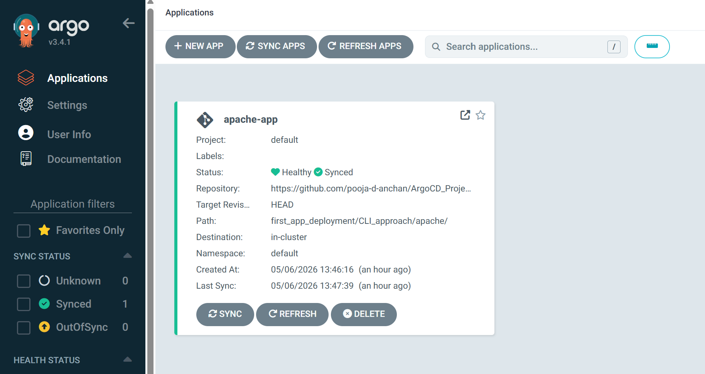

# 🚀 Apache Deployment using ArgoCD CLI (GitOps)

## 📌 Project Overview

This project demonstrates a simple **Apache application deployment** on Kubernetes using **ArgoCD CLI (GitOps approach)**.

* Kubernetes Cluster: Kind
* Deployment Tool: ArgoCD
* Application: Apache Web Server

---

## ⚙️ Architecture

* ArgoCD monitors the Git repository
* Kubernetes manifests are stored in Git
* Any changes pushed to Git are automatically deployed

---

## 📂 Project Structure

```
first_app_deployment/
└── CLI_approach/
    └── apache/
        ├── apache_deployment.yaml
        └── apache_svc.yaml
```

---

## 🚀 Deployment Steps

1. Create Kubernetes cluster using Kind
2. Install ArgoCD
3. Push manifests to GitHub
4. Create ArgoCD application using CLI
5. Enable auto-sync

---

## 📊 ArgoCD UI (Application Status)



---

## 🌐 Apache Webpage


---

## 🔥 Key Features

* GitOps-based deployment
* Automatic synchronization
* Self-healing enabled
* Auto-pruning of resources

---

## 📌 Commands Used

```bash
argocd app create apache-app \
  --repo https://github.com/<your-username>/ArgoCD_Project.git \
  --path first_app_deployment/CLI_approach/apache \
  --dest-server https://kubernetes.default.svc \
  --dest-namespace default \
  --sync-policy automated \
  --self-heal \
  --auto-prune
```

---

## 🎯 Outcome

* Apache deployed successfully on Kubernetes
* Managed entirely via ArgoCD
* Demonstrates real-world GitOps workflow

---

