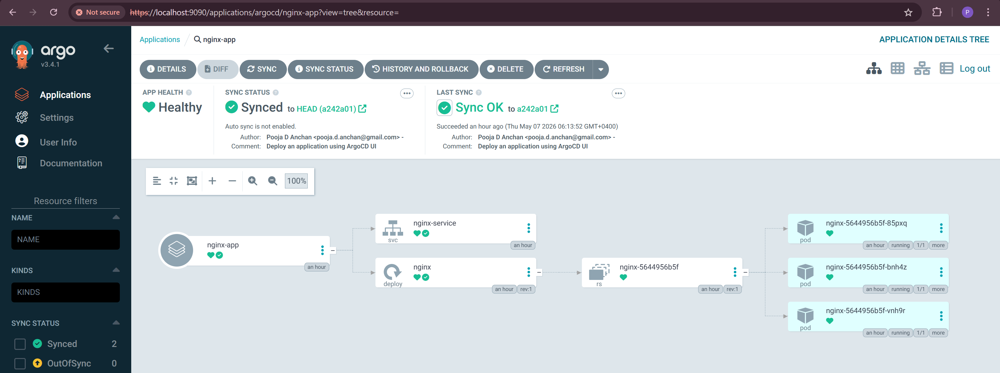
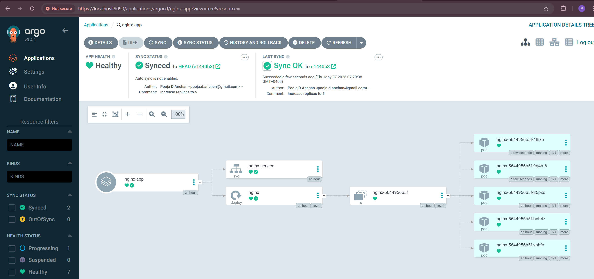
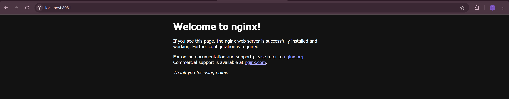

# 🚀 NGINX Deployment using ArgoCD UI Approach

## 📌 Project Overview

This project demonstrates deploying an **NGINX application** on Kubernetes using **ArgoCD UI** following the GitOps approach.

Theory
In the UI approach, we create applications directly from the ArgoCD dashboard.
This means ArgoCD generates the Application resource (CRD) inside the cluster for us.
The app definition lives only in the cluster, not in Git.
It’s quick and great for demos, but not true GitOps (since configs are not version-controlled).
✅ Best practice: Use the Declarative approach (CRDs in Git) for production.
❌ The UI method is best suited for learning and testing.


## 🛠️ Technologies Used

* Kubernetes
* Kind Cluster
* ArgoCD
* Docker Desktop
* GitHub
* NGINX

---

## 📂 Project Structure

```text
first_app_deployment/
└── UI_approach/
    └── nginx/
        ├── nginx_deployment.yaml
        └── nginx_service.yaml
```

---

## ⚙️ Deployment Workflow

1. Create a Kubernetes cluster using Kind
2. Install ArgoCD in the cluster
3. Push Kubernetes manifests to GitHub
4. Create the application through the ArgoCD UI
5. ArgoCD syncs the manifests to the Kubernetes cluster
6. Access the deployed NGINX application in the browser

---

## 🌐 GitHub Repository

Repository Path:

```text
https://github.com/pooja-d-anchan/ArgoCD_Project/tree/main/first_app_deployment/UI_approach
```

---

## 📊 ArgoCD UI After Deployment

Nginx app deployed with 3 replicas:

```text
images/nginx-app-3replicas.png
```



When replicas are incresed to 5:

```text
images/nginx-app-5replicas.png
```



---

## 🌍 NGINX Application in Browser

```text
images/nginx-app.png
```



---

## 🚀 ArgoCD Application Configuration

| Field            | Value                                                                                                        |
| ---------------- | ------------------------------------------------------------------------------------------------------------ |
| Application Name | nginx-app                                                                                                    |
| Repository URL   | [https://github.com/pooja-d-anchan/ArgoCD_Project.git](https://github.com/pooja-d-anchan/ArgoCD_Project.git) |
| Path             | first_app_deployment/UI_approach                                                                       |
| Cluster URL      | [https://kubernetes.default.svc](https://kubernetes.default.svc)                                             |
| Namespace        | default                                                                                                      |

---

## 🔥 Features Demonstrated

* GitOps workflow using ArgoCD
* Kubernetes deployment management

---

## 📋 Useful Commands

### Check Kubernetes Nodes

```bash
kubectl get nodes
```

### Check Pods

```bash
kubectl get pods
```

### Check Services

```bash
kubectl get svc
```

### Port Forward ArgoCD UI

```bash
kubectl port-forward svc/argocd-server -n argocd 9090:443
```

---

## 🎯 Outcome

* Successfully deployed NGINX using ArgoCD UI

---

## 👩‍💻 Author

**Pooja D Anchan**

